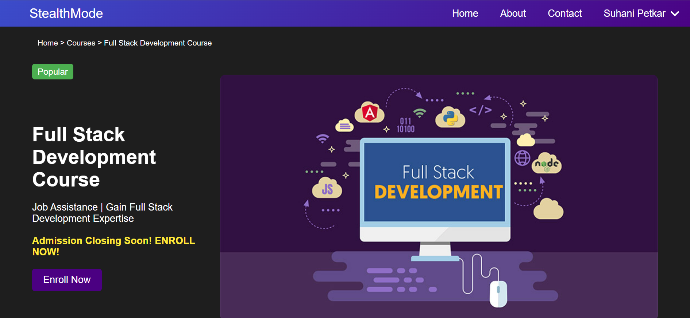

# SleathMode Course Mangament

## Overview

The Course Management Platform is a web application that allows users to register, log in, view a list of courses, and enroll in courses. The application uses React.js for the frontend, Node.js with Express for the backend, and MongoDB for the database. The backend is hosted on AWS EC2 as well as Vercel.





## Features

- **User Authentication**: Users can register and log in to access the platform.
- **Course Listing**: Users can view a list of available courses.
- **Course Enrollment**: Users can enroll in courses and view their enrolled courses in Profile section in Navbar.
- **Responsive Design**: The application is responsive and user-friendly.
- **Secure and Efficient**: Implements authentication, authorization, and secure database interactions.

## Technologies Used

### Frontend
- **React.js**: A JavaScript library for building user interfaces.
- **React Router**: For seamless navigation between different pages.
- **Axios**: For making HTTP requests to the backend API.
- **CSS**: For styling the application.
  
### Backend
- **Node.js**: A JavaScript runtime built on Chrome's V8 JavaScript engine.
- **Express.js**: A fast, unopinionated, minimalist web framework for Node.js.
- **bcryptjs**: For hashing passwords.
- **jsonwebtoken**: For generating and verifying JWT tokens.
- **body-parser**: For parsing incoming request bodies.
- **cors**: For enabling Cross-Origin Resource Sharing.

### Database
- **MongoDB**: A NoSQL database for storing user and course data.
- **Mongoose**: An ODM (Object Data Modeling) library for MongoDB and Node.js.

### DevOps & Deployment
- **AWS EC2**: For hosting the backend server.
- **Frontend and Backend**: Vercel
- **Nodemon**: For automatically restarting the server during development.

## Available Scripts

Runs the app in the development mode.\
Open [https://sleath-frontend.vercel.app/](https://sleath-frontend.vercel.app/) to view it in the browser.


1. **Clone the repository:**

   ```bash
   git clone https://github.com/moto23/SleathMode_Project.git

In the project directory, you can run:

### `npm start`

Runs the app in the development mode.\
Open [http://localhost:3001](http://localhost:3001) to view it in your browser.

### `npm install`

The page will reload if you make edits.\
You will also see any lint errors in the console.

### `npm test`

Launches the test runner in the interactive watch mode.\
See the section about [running tests](https://facebook.github.io/create-react-app/docs/running-tests) for more information.

### `npm run build`

Builds the app for production to the `build` folder.\
It correctly bundles React in production mode and optimizes the build for the best performance.

The build is minified and the filenames include the hashes.\
Your app is ready to be deployed!

See the section about [deployment](https://facebook.github.io/create-react-app/docs/deployment) for more information.

### `npm run eject`

**Note: this is a one-way operation. Once you `eject`, you can’t go back!**

If you aren’t satisfied with the build tool and configuration choices, you can `eject` at any time. This command will remove the single build dependency from your project.

Instead, it will copy all the configuration files and the transitive dependencies (webpack, Babel, ESLint, etc) right into your project so you have full control over them. All of the commands except `eject` will still work, but they will point to the copied scripts so you can tweak them. At this point you’re on your own.

## Learn More

You can learn more in the [Create React App documentation](https://facebook.github.io/create-react-app/docs/getting-started).

To learn React, check out the [React documentation](https://reactjs.org/).
